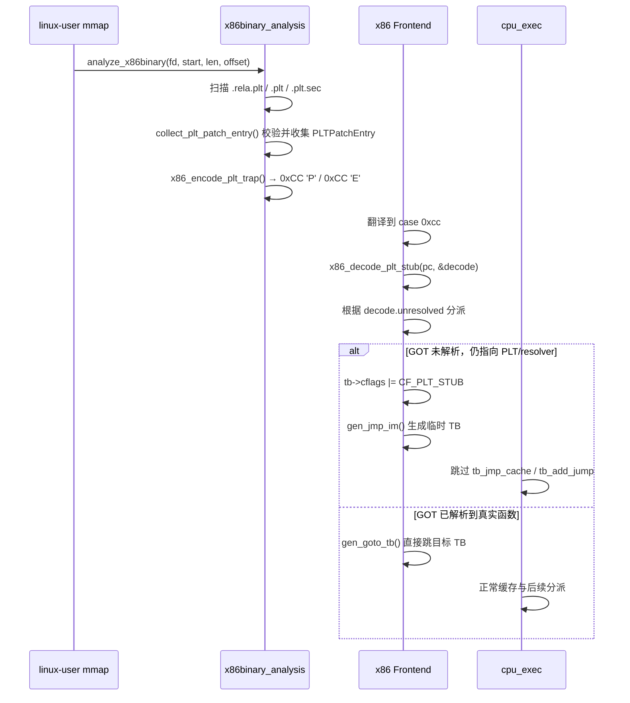

# CONFIG_INDIRECT_JUMP_OPT_PLT 分析

## 概述

`CONFIG_INDIRECT_JUMP_OPT_PLT` 是一项针对 **sw_64** 平台的 QEMU linux-user 定制优化，用来加速 **x86_64 guest 动态链接中的 PLT 间接跳转**。

**核心思想**：在 guest ELF 映射为可执行后，扫描其 `.rela.plt`、`.plt`、`.plt.sec`，把原始 PLT stub 改写成一类可被翻译器识别的特殊 `int3` 标记；在 x86 翻译阶段识别这些标记，直接读取对应 GOT 槽内容：

- 如果 GOT 还未解析，生成一个**临时 TB** 跳回 PLT resolver；
- 如果 GOT 已经解析到真实函数地址，直接生成跳往目标地址的 TB；
- 执行循环层再确保“未解析状态”的 TB 不进入普通 TB cache，避免 GOT 更新后复用过期 TB。

> [!IMPORTANT]
> 所有代码均受 `#if defined(CONFIG_INDIRECT_JUMP_OPT_PLT) && defined(__sw_64__)` 或相关组合宏保护，仅在 sw_64 平台启用 `--enable-indirect-jump-opt-plt` 时生效。

---

## 1. 构建系统集成

### 1.1 configure 脚本

| 位置 | 作用 |
|------|------|
| [configure:370](file:///d:/Qemu6/Qemu6_opt/configure#L370) | 默认值 `indirect_jump_opt_plt="no"` |
| [configure:1092](file:///d:/Qemu6/Qemu6_opt/configure#L1092) | `--enable-indirect-jump-opt-plt` |
| [configure:1094](file:///d:/Qemu6/Qemu6_opt/configure#L1094) | `--disable-indirect-jump-opt-plt` |
| [configure:1096](file:///d:/Qemu6/Qemu6_opt/configure#L1096) | `--enable-indirect-jump-opt-plt-debug` |
| [configure:5602-5606](file:///d:/Qemu6/Qemu6_opt/configure#L5602-L5606) | 生成 `CONFIG_INDIRECT_JUMP_OPT_PLT(_DEBUG)=y` 到 `config-host.mak` |

**依赖关系**：

1. `--enable-indirect-jump-opt-plt-debug` 会**隐式启用** `CONFIG_INDIRECT_JUMP_OPT_PLT`。
2. 该优化依赖 `x86binary_analysis` 模块，因此在链接阶段会额外引入 `libelf`、`zlib`、`libdl`。

### 1.2 meson 构建

| 位置 | 作用 |
|------|------|
| [meson.build:2289-2291](file:///d:/Qemu6/Qemu6_opt/meson.build#L2289-L2291) | 当 `CONFIG_INDIRECT_JUMP_OPT_PLT` 打开时追加 `-lelf -lz -ldl` |

---

## 2. 数据结构与标记位

### 2.1 PLT 标记字节与解码结构

```c
// linux-user/x86binary_analysis.h:26-28
#define PLT_WITHOUT_CET 0x50CC /* 'P' 0xCC - 非CET模式 (小端序) */
#define PLT_WITH_CET    0x45CC /* 'E' 0xCC - CET模式 (小端序) */
#define PLT_ENTRY_SIZE  16

// linux-user/x86binary_analysis.h:34-38
typedef struct X86PLTDecode {
  uint64_t dynsym_addr;
  uint64_t plt_begin_va;
  bool unresolved;
} X86PLTDecode;
```

`PLT_WITHOUT_CET` / `PLT_WITH_CET` 定义了“被改写后的 PLT stub 前缀”：翻译器看到 `int3 (0xCC)` 后，会继续检查后续字节是否是 `'P'` 或 `'E'`，把它解释成“PLT 优化陷阱”而非普通断点。`PLT_ENTRY_SIZE` 统一了分析阶段（计算 stub 起始地址）和翻译阶段（判断 GOT 是否仍落在 stub 内）的长度假设。`X86PLTDecode` 是翻译阶段的共享解码结果结构。

### 2.2 `PLTPatchEntry`

```c
// linux-user/x86binary_analysis.c
typedef struct PLTPatchEntry {
  uintptr_t stub_va;
  uint64_t plt_begin_va;
  uint32_t offset;
  int with_cet;
  int with_bnd;
} PLTPatchEntry;
```

`PLTPatchEntry` 是分析/改写阶段的内部线性数组元素，不再暴露到 `x86binary_analysis.h`：

- `stub_va`：待改写的 PLT stub 地址；
- `plt_begin_va`：传统 `.plt` 起始地址，用于 CET 形态下判断 GOT 是否仍回指 PLT 区；
- `offset`：收集阶段从原始 `jmp *disp32(%rip)` 中解析出的 GOT 位移；
- `with_cet` / `with_bnd`：记录 CET 形态和可选 `0xf2` 前缀，避免 patch 阶段重复读取/判断原始 stub。

### 2.3 `TranslationBlock.cflags` 中的 `CF_PLT_STUB`

```c
// include/exec/exec-all.h:458
#define CF_PLT_STUB 0x00100000 /* unresolved PLT stub TB: skip normal lookup/cache chaining */
```

这个标记位表示：

- 当前 TB 对应的是“**GOT 尚未解析完成**”的 PLT stub；
- 该 TB 只能临时执行，不能进入正常的 TB lookup / cache / 链化路径。

---

## 3. 分析阶段：ELF 映射后改写 PLT

### 3.1 触发时机

当 linux-user 中有新的可执行映射建立时，会在 `mmap` 完成后调用 `analyze_x86binary()`：

```c
// linux-user/mmap.c:724-728
if (target_prot == (PROT_EXEC | PROT_READ)) {
    analyze_x86binary(fd, start, len, offset);
}
```

这里的调用条件意味着：只有映射为 `RX` 的 ELF 片段才会进入该分析流程。

### 3.2 分析入口

| 位置 | 作用 |
|------|------|
| [linux-user/x86binary_analysis.c:1036](file:///d:/Qemu6/Qemu6_opt/linux-user/x86binary_analysis.c#L1036) | `analyze_x86binary()` 对外入口 |
| [linux-user/x86binary_analysis.c:871](file:///d:/Qemu6/Qemu6_opt/linux-user/x86binary_analysis.c#L871) | `do_analyze_x86binary()` 核心分析函数 |

入口函数会做几件事：

1. 用 `fstat` + `(dev, ino)` 去重，避免同一文件重复分析；
2. 通过 `/proc/self/fd/<fd>` 读取库名；
3. 扫描 ELF section，查找 `.dynsym`、`.rela.plt`、`.plt`、`.plt.sec`；
4. 对 PLT 做专门分析和字节改写。

### 3.3 `.rela.plt` 解析

```c
// linux-user/x86binary_analysis.c:763
static void do_plt_opt_analyze(...)
```

该函数会遍历 `.rela.plt` 中的重定位项，只处理：

```c
// linux-user/x86binary_analysis.c:813
if (ELF64_R_TYPE(rela.r_info) == R_X86_64_JUMP_SLOT) {
    ...
}
```

也就是说，这个优化明确针对 **x86_64 动态链接的跳槽重定位**，而不是一般意义上的所有间接跳转。

### 3.4 计算 PLT stub 地址

对每个 `R_X86_64_JUMP_SLOT`，代码会根据 PLT 形式计算 stub 起始地址：

```c
// linux-user/x86binary_analysis.c:817-824
if (plt_sec_va) {
    plt_stub_va = plt_sec_va + i * PLT_ENTRY_SIZE;
    with_cet = 1;
} else {
    plt_stub_va = plt_begin_va + (i + 1) * PLT_ENTRY_SIZE;
    with_cet = 0;
}
```

可见实现默认假设：

- `.plt.sec` 形式每项大小为 16 字节；
- 非 CET `.plt` 形式跳过第一个 PLT0，因此使用 `(i + 1) * 16`。

### 3.5 收集阶段完成布局校验

改写前先在收集阶段做一次**布局校验**，不匹配的 stub 会被直接跳过，不再乐观改写；匹配的 stub 会被保存为 `PLTPatchEntry`，同时缓存 GOT displacement：

```c
// linux-user/x86binary_analysis.c
static bool collect_plt_patch_entry(uintptr_t plt_stub_va,
                                    uint64_t plt_begin_va, int with_cet,
                                    PLTPatchEntry *entry) {
  if (with_cet) {
    if (*(uint32_t *)plt_stub_va != 0xfa1e0ff3) return false; /* endbr64 */
    if (*(uint8_t *)(plt_stub_va + 4) == 0xf2) {
      if (*(uint16_t *)(plt_stub_va + 5) != 0x25ff) return false; /* bnd jmp */
      entry->with_bnd = 1;
      entry->offset = *(uint32_t *)(plt_stub_va + 7);
      return true;
    }
    if (*(uint16_t *)(plt_stub_va + 4) != 0x25ff) return false;   /* jmp */
    entry->offset = *(uint32_t *)(plt_stub_va + 6);
    return true;
  }
  if (*(uint16_t *)plt_stub_va != 0x25ff) return false;           /* jmp */
  entry->offset = *(uint32_t *)(plt_stub_va + 2);
  return true;
}
```

改写本体现在是 `x86binary_analysis.c` 内部 helper，不再对外公开：

| 位置 | 作用 |
|------|------|
| [linux-user/x86binary_analysis.c:687](file:///d:/Qemu6/Qemu6_opt/linux-user/x86binary_analysis.c#L687) | `collect_plt_patch_entry()`：布局校验 + offset 缓存 |
| [linux-user/x86binary_analysis.c:724](file:///d:/Qemu6/Qemu6_opt/linux-user/x86binary_analysis.c#L724) | `x86_encode_plt_trap()`：按 `PLTPatchEntry` 改写 |

```c
// linux-user/x86binary_analysis.c
static void x86_encode_plt_trap(const PLTPatchEntry *entry) {
  uintptr_t plt_stub_va = entry->stub_va;

  if (entry->with_cet) {
    *(uint16_t *)plt_stub_va = (uint16_t)PLT_WITH_CET;
    /* 根据 entry->with_bnd / entry->offset 重组 disp32 */
    ...
    *(uint64_t *)(plt_stub_va + 8) = entry->plt_begin_va;
  } else {
    *(uint16_t *)plt_stub_va = (uint16_t)PLT_WITHOUT_CET;
  }

  ANALYZE_STATS_DO(x86binary_analysis_note_plt_stub_patched(););
}
```

#### 非 CET 情况

原始形态：

```asm
jmp *disp32(%rip)
push imm32
jmp plt0
```

改写后前两个字节变成 `0xCC 'P'`，剩余 `disp32` 保留在原位，供翻译阶段提取 GOT 位移。

#### CET 情况

原始形态（可能存在 `0xf2` 前缀）：

```asm
endbr64
[f2] jmp *disp32(%rip)
nopw ...
```

改写后写入 `0xCC 'E'` 作为前缀；若原来存在 `0xf2`，新布局中会保留；`plt_begin_va` 被填入 `pc + 8` 后的 8 字节，供翻译阶段判断 GOT 当前是否仍然指回 PLT 区间。

### 3.6 页权限处理与迭代改写

`replace_plt_with_trap()` 接收线性 `GArray` 和收集阶段得到的 `PLTPatchRange`。要 `mprotect` 的范围由所有**已通过布局校验的 stub** 的 `[min, max + PLT_ENTRY_SIZE]` 动态计算，而不是基于 mmap 的 `(start_addr, end_addr)`：

```c
// linux-user/x86binary_analysis.c
static inline void replace_plt_with_trap(GArray *plt_entries,
                                         const PLTPatchRange *range) {
  if (plt_entries->len == 0) return;

  uintptr_t aligned_start = range->min_stub & ~(page_size - 1);
  uintptr_t aligned_end =
      ((range->max_stub + PLT_ENTRY_SIZE) + page_size - 1) & ~(page_size - 1);
  ...
  mprotect((void *)aligned_start, length, original_prot | PROT_WRITE);

  for (guint i = 0; i < plt_entries->len; i++) {
    PLTPatchEntry *entry = &g_array_index(plt_entries, PLTPatchEntry, i);
    x86_encode_plt_trap(entry);
  }
  mprotect((void *)aligned_start, length, original_prot);
}
```

`do_plt_opt_analyze()` 不再创建 `current_plt_table` / `global_plt_table`，也不再分配 `PLT_HashValue`。它遍历 `.rela.plt` 后只把有效项 append 到线性数组，最后一次性 `mprotect` 并 patch。

这说明该优化依然是**侵入式二进制改写**，但范围更紧（按实际 stub 集合而非整段映射），并且对“陌生 stub 形态”更保守（直接跳过、不改写）。

---

## 4. 翻译阶段：把特殊 PLT stub 变成定制控制流

### 4.1 代码入口

在 x86 翻译器中，`0xCC` 对应 `int3`：

| 位置 | 作用 |
|------|------|
| [target/i386/tcg/translate.c:8266](file:///d:/Qemu6/Qemu6_opt/target/i386/tcg/translate.c#L8266) | `case 0xcc` |
| [target/i386/tcg/translate.c:8268-8288](file:///d:/Qemu6/Qemu6_opt/target/i386/tcg/translate.c#L8268-L8288) | `CONFIG_INDIRECT_JUMP_OPT_PLT` 的 PLT 特化逻辑 |

这个优化不是新增独立 opcode，而是**劫持了已被改写的 `int3` 指令模式**。

### 4.2 共享解码协议

解码逻辑已从 translate.c 抽到 `linux-user/x86binary_analysis.c` 的 `x86_decode_plt_stub()`，并通过 `x86binary_analysis.h` 暴露：

```c
// linux-user/x86binary_analysis.c:810-840
bool x86_decode_plt_stub(uint64_t pc, X86PLTDecode *decode) {
  if (*(uint16_t *)(pc) == PLT_WITHOUT_CET) {
    offset = *(uint32_t *)(pc + 2);
    got = pc + 6 + (uint64_t)offset;
    decode->dynsym_addr = *(uint64_t *)got;
    decode->plt_begin_va = pc;
    decode->unresolved = decode->dynsym_addr >= pc &&
                         decode->dynsym_addr < pc + PLT_ENTRY_SIZE;
    return true;
  }

  if (*(uint16_t *)(pc) == PLT_WITH_CET) {
    /* 可选 0xf2 前缀：bnd jmp 时 got = pc + 11 + disp32，
     *                 否则     got = pc + 10 + disp32 */
    ...
    decode->dynsym_addr = *(uint64_t *)got;
    decode->plt_begin_va = *(uint64_t *)(pc + 8);
    decode->unresolved = decode->dynsym_addr >= decode->plt_begin_va &&
                         decode->dynsym_addr < pc;
    return true;
  }

  return false;
}
```

此函数是分析阶段内部 `x86_encode_plt_trap()` 的反向过程。两侧共用同一份头文件中的 `PLT_WITHOUT_CET` / `PLT_WITH_CET` / `PLT_ENTRY_SIZE`，并由 `X86PLTDecode` 承载翻译阶段解码结果，避免字节偏移在分析/翻译两端因独立演化而漂移。

语义上：

- 非 CET：重建 `jmp *disp32(%rip)` 的行为，即 `got = rip_after_instruction + disp32`，`unresolved` 判断目标是否仍落在当前 stub 内（`[pc, pc + PLT_ENTRY_SIZE)`）；
- CET：从 `pc + 8` 读取 `plt_begin_va`，`unresolved` 判断目标是否仍指向 PLT 区间（`[plt_begin_va, pc)`）。

### 4.3 翻译侧的分派

`case 0xcc` 只剩协议判别 + 分支，再加三个运行时计数器 hook：

```c
// target/i386/tcg/translate.c:8268-8288
X86PLTDecode plt_decode;
uint64_t pc = s->pc - 1;

if (x86_decode_plt_stub(pc, &plt_decode)) {
    x86binary_analysis_note_plt_trap_hit();
    if (plt_decode.unresolved) {
        x86binary_analysis_note_plt_trap_unresolved();
        s->base.tb->cflags |= CF_PLT_STUB;
        gen_jmp_im(s, plt_decode.dynsym_addr - s->cs_base);
        gen_eob(s);
        s->base.is_jmp = DISAS_NORETURN;
    } else {
        x86binary_analysis_note_plt_trap_resolved();
        gen_goto_tb(s, 0, plt_decode.dynsym_addr - s->cs_base);
        s->base.is_jmp = DISAS_NORETURN;
    }
    break;
}
```

两个执行路径：

- **未解析 GOT**（`plt_decode.unresolved` 为真）：标记 `CF_PLT_STUB`，生成一个**短生命周期 TB** 跳回 resolver；执行一次后不得进入 TB cache（见 §5）。
- **已解析 GOT**：直接 `goto_tb` 到真实函数地址，翻译后的 TB 不再保留“guest 执行一次 PLT 间接跳转”的形态。

三个 `x86binary_analysis_note_plt_trap_*` 调用由 06909bc 引入，用于运行时观测：非 debug 构建下它们被定义为 `static inline` 空函数（见 `x86binary_analysis.h:140-144`），热路径零开销。

---

## 5. 执行阶段：防止未解析 PLT TB 被错误缓存

### 5.1 `cpu_exec` 中的特殊返回

在 TB 新生成完成后，执行循环会检查 `CF_PLT_STUB`：

```c
// accel/tcg/cpu-exec.c:553-561
if (tb_cflags(tb) & CF_PLT_STUB) {
    /* PLT_STUB TB: GOT is not yet resolved. This TB must be
     * ephemeral ...
     */
    return tb;
}
```

这段逻辑的直接效果是：

1. 跳过 `tb_jmp_cache` 插入；
2. 跳过后续可能建立的直接跳转连接；
3. 让该 TB 成为一次性的“解析过渡 TB”。

### 5.2 为什么必须这么做

如果不这么做，会出现典型错误：

1. 第一次进入 PLT stub 时，GOT 还未解析；
2. TB 被翻译成“跳回 PLT resolver”；
3. 动态链接器解析完成后，GOT 更新为真实函数地址；
4. 但旧 TB 仍在 cache 中，后续执行继续走旧路径，导致优化失效甚至逻辑不一致。

`CF_PLT_STUB` 的目的就是阻止这种“把未解析状态缓存下来”的情况。

### 5.3 清除 `cflags_next_tb` 中的 `CF_PLT_STUB`

```c
// accel/tcg/cpu-exec.c:842
cpu->cflags_next_tb = (tb->cflags & ~(CF_COUNT_MASK | CF_PLT_STUB)) | insns_left;
```

这一步避免 `CF_PLT_STUB` 被意外传播到后继 TB 的 `cflags_next_tb` 中。

---

## 6. Debug 模式

### 6.1 统计输出

`CONFIG_INDIRECT_JUMP_OPT_PLT_DEBUG` 会额外启用：

- 分析次数、跳过次数、耗时统计；
- **改写阶段**计数器：`plt_stub_patched`（成功改写的 stub 数）、`plt_stub_skipped`（因布局校验失败被跳过的 stub 数）；
- **运行时**计数器：`plt_trap_hits`（`case 0xcc` 识别为 PLT trap 的次数）、`plt_trap_unresolved`（其中 GOT 未解析的次数）、`plt_trap_resolved`（其中 GOT 已解析、直接 `goto_tb` 的次数）；
- 程序退出时打印统计结果。

相关位置：

| 位置 | 作用 |
|------|------|
| [linux-user/x86binary_analysis.c:43-130](file:///d:/Qemu6/Qemu6_opt/linux-user/x86binary_analysis.c#L43-L130) | `AnalyzeStats` / `x86binary_analysis_note_*` / `x86binary_analysis_dump_stats()` |
| [linux-user/x86binary_analysis.h:140-144](file:///d:/Qemu6/Qemu6_opt/linux-user/x86binary_analysis.h#L140-L144) | 非 debug 构建下把 `note_*` 内联为空函数 |
| [linux-user/exit.c:48-49](file:///d:/Qemu6/Qemu6_opt/linux-user/exit.c#L48-L49) | 退出时调用 `x86binary_analysis_dump_stats()` |

### 6.2 Debug 不是独立功能

configure 中明确写死了：

```sh
if test "$indirect_jump_opt_plt_debug" = "yes" ; then
  echo "CONFIG_INDIRECT_JUMP_OPT_PLT_DEBUG=y" >> $config_host_mak
  echo "CONFIG_INDIRECT_JUMP_OPT_PLT=y" >> $config_host_mak
fi
```

因此 debug 只是主功能的增强观察模式，不存在“只开 debug 不开优化”的组合。

---

## 7. 整体数据流



---

## 8. 涉及文件汇总

| 层次 | 文件 | 作用 |
|------|------|------|
| 构建 | [configure](file:///d:/Qemu6/Qemu6_opt/configure#L370) | `--enable-indirect-jump-opt-plt` / debug 开关 |
| 构建 | [meson.build](file:///d:/Qemu6/Qemu6_opt/meson.build#L2289) | 追加 `-lelf -lz -ldl` |
| 共享协议 | [linux-user/x86binary_analysis.h](file:///d:/Qemu6/Qemu6_opt/linux-user/x86binary_analysis.h#L26) | `PLT_WITHOUT_CET` / `PLT_WITH_CET` / `PLT_ENTRY_SIZE` / `X86PLTDecode`；`x86_decode_plt_stub` / `note_*` 声明 |
| PLT 收集 | [linux-user/x86binary_analysis.c](file:///d:/Qemu6/Qemu6_opt/linux-user/x86binary_analysis.c#L687) | `collect_plt_patch_entry()`：布局校验、offset 缓存、`PLTPatchEntry` 填充 |
| PLT 改写 | [linux-user/x86binary_analysis.c](file:///d:/Qemu6/Qemu6_opt/linux-user/x86binary_analysis.c#L724) | 内部 `x86_encode_plt_trap()` |
| 改写范围 | [linux-user/x86binary_analysis.c](file:///d:/Qemu6/Qemu6_opt/linux-user/x86binary_analysis.c#L745) | `replace_plt_with_trap()`：按实际 stub 集合动态算 mprotect 范围 + 线性数组改写 |
| PLT 解码 | [linux-user/x86binary_analysis.c](file:///d:/Qemu6/Qemu6_opt/linux-user/x86binary_analysis.c#L775) | `x86_decode_plt_stub()` |
| ELF 分析 | [linux-user/x86binary_analysis.c](file:///d:/Qemu6/Qemu6_opt/linux-user/x86binary_analysis.c#L856) | `do_plt_opt_analyze()` |
| 映射钩子 | [linux-user/mmap.c](file:///d:/Qemu6/Qemu6_opt/linux-user/mmap.c#L724) | `analyze_x86binary()` 调用时机 |
| TB 标志 | [include/exec/exec-all.h](file:///d:/Qemu6/Qemu6_opt/include/exec/exec-all.h#L458) | `CF_PLT_STUB`（"unresolved PLT stub TB"） |
| 前端翻译 | [target/i386/tcg/translate.c](file:///d:/Qemu6/Qemu6_opt/target/i386/tcg/translate.c#L8266) | `case 0xcc` 调用共享解码 + 运行时计数器 |
| 执行循环 | [accel/tcg/cpu-exec.c](file:///d:/Qemu6/Qemu6_opt/accel/tcg/cpu-exec.c#L553) | 跳过临时 TB 的缓存 |
| 退出清理 | [linux-user/syscall.c](file:///d:/Qemu6/Qemu6_opt/linux-user/syscall.c#L10402) | `exit_group` 也触发 `free_libentries()`（覆盖 PLT 开关） |
| 调试退出 | [linux-user/exit.c](file:///d:/Qemu6/Qemu6_opt/linux-user/exit.c#L48) | 打印分析统计 |

---

## 9. 关键设计决策

1. **通过改写 PLT stub 建立“静态可识别模式”**：运行时不需要通用地识别任意 `jmp *mem`，只需识别专门编码过的 `int3 + tag`。

2. **把“未解析 GOT”与“已解析 GOT”区分为两类 TB**：前者只能短期存在，后者可以进入正常 TB 缓存与链化流程。

3. **优化目标是动态链接路径，不是一般间接跳转**：实现严格依赖 `.rela.plt` 和 `R_X86_64_JUMP_SLOT`，并非所有 indirect jump 都会受益。

4. **通过 `mprotect` 原地修改 guest 代码页**：这是一个侵入式但成本较低的方案，省去了在翻译时维护额外大表的复杂性。

5. **正确性优先于缓存收益**：一旦发现是 `CF_PLT_STUB`，宁可放弃 TB cache，也要保证 GOT 解析后能重新翻译出正确的永久 TB。

6. **当前实现是 sw_64 定制路径**：从条件编译和文件组织上看，这不是上游通用的 QEMU TCG 优化，而是面向 sw_64 host + x86 guest linux-user 场景的专用增强。

---

## 10. 局限与风险

1. **平台局限**：整个实现基本都受 `defined(__sw_64__)` 限制，移植性很弱。

2. **场景局限**：触发点在 `linux-user/mmap.c`，因此它服务的是 linux-user 路径，不是 system emulation 通用机制。

3. **对 PLT 形态有假设**：虽然目前在 `collect_plt_patch_entry()` 中做了布局校验，遇到不匹配的 stub 会保守地跳过而不至于改写出差错，但这依然意味着若 guest toolchain 生成的 stub 形式发生未知变化，该优化将对这些新变体失效。

4. **代码页自修改风险**：需要临时给 RX 页加写权限。若部署环境存在更严格的 W^X 策略或额外完整性检查，可能产生兼容性问题。

5. **未做热 PLT 预测**：当前仍保持 eager patch 策略，会改写所有通过校验的 `R_X86_64_JUMP_SLOT` stub；从 benchmark 看，实际运行时只命中其中一部分，但为避免把复杂度推入翻译热路径，当前没有引入 lazy patch 或 profile-guided patch。

6. **资源统一清理**：`free_libentries()` 仍负责 native-libs 相关全局资源以及已加载 inode/name 表；PLT patch 路径已不再维护独立全局 PLT 表。
