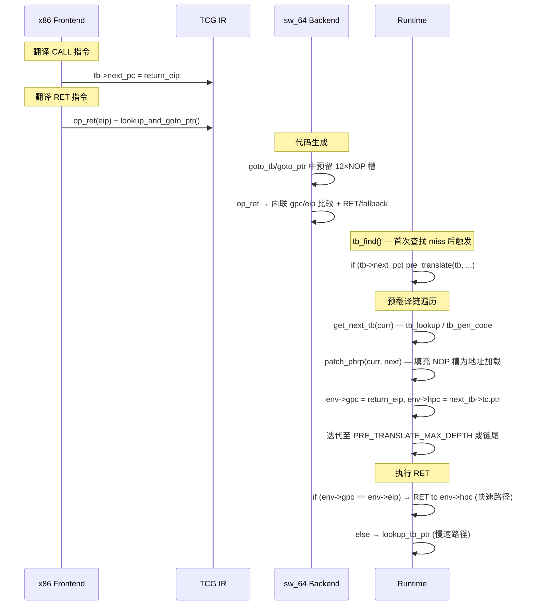

# CONFIG_RET_OPT 分析

## 概述

`CONFIG_RET_OPT` 是一项针对 **sw_64** 架构的 QEMU TCG 优化，实现了**基于预翻译的返回路径预测（Pre-translation Based Return Path Prediction, PBRP）**。

**核心思想**：在翻译 x86 `CALL` 指令时，记录返回地址（`next_pc`）；在翻译 x86 `RET` 指令时，生成特殊的 `op_ret` TCG 操作。后端为 `op_ret` 生成一段内联比较代码：如果实际返回地址等于预期的 `next_pc`，则直接跳转到对应的 host TB，跳过 `lookup_tb_ptr` 的开销。

> [!IMPORTANT]
> 所有代码均受 `#if defined(CONFIG_RET_OPT) && defined(__sw_64__)` 保护，仅在 sw_64 平台启用 `--enable-ret-opt` 时生效。

---

## 1. 构建系统集成

### 1.1 configure 脚本

| 位置                                                                    | 作用                                          |
| ----------------------------------------------------------------------- | --------------------------------------------- |
| [configure:365](file:///d:/Qemu6/Qemu6_opt/configure#L365)              | 默认值 `ret_opt="no"`                         |
| [configure:1072-1074](file:///d:/Qemu6/Qemu6_opt/configure#L1072-L1074) | `--enable-ret-opt` / `--disable-ret-opt` 开关 |
| [configure:5580-5582](file:///d:/Qemu6/Qemu6_opt/configure#L5580-L5582) | 生成 `CONFIG_RET_OPT=y` 到 `config-host.mak`  |

**依赖关系**：启用 `ret_opt` 会**隐式启用** `pretr_opt`（configure:5581 `pretr_opt="yes"`），因为 PBRP 依赖 `CONFIG_PRETR_OPT` 的预翻译链来提前生成后续 TB。

---

## 2. 数据结构

### 2.1 CPUX86State 新增字段

```c
// target/i386/cpu.h:1417-1420
#if defined(CONFIG_RET_OPT) && defined(__sw_64__)
    target_ulong gpc;   // 预期的 guest PC（即 CALL 指令的 next_eip）
    uintptr_t hpc;      // 预期 TB 的 host code 指针
#endif
```

这两个字段由 `patch_pbrp()` 在运行时填充，由后端 `op_ret` 代码在执行时读取比较。

### 2.2 TranslationBlock 新增字段

```c
// include/exec/exec-all.h:495-502
#if defined(CONFIG_PRETR_OPT) && defined(__sw_64__)
    target_ulong next_pc;           // 预翻译链：guest target PC（供 pre_translate 遍历）
#endif
#if defined(CONFIG_RET_OPT) && defined(__sw_64__)
    uintptr_t jmp_to_next_offset;  // PBRP patch slot 的偏移（从 tb->tc.ptr 起）
#endif
```

`next_pc` 在翻译 CALL 指令时写入，在 `pre_translate()` 中用于查找/生成后续 TB。`jmp_to_next_offset` 在代码生成时记录（NOP 槽位的位置），后续由 `patch_pbrp()` 用真实的地址加载指令覆盖。

> [!NOTE]
> `next_pc` 受 `CONFIG_PRETR_OPT`（而非 `CONFIG_RET_OPT`）保护，因为它同时服务于 `pre_translate` 预翻译链和 RET_OPT 的 patch 路径。

### 2.3 TCGContext 新增字段

```c
// include/tcg/tcg.h:625-630
#if defined(CONFIG_RET_OPT) && defined(__sw_64__)
    uintptr_t *pbrp_patch_offset;  // 指向 tb->jmp_to_next_offset 的指针
    target_ulong tb_next_pc;       // 当前 TB 的 next_pc
#endif
```

---

## 3. TCG IR 层

### 3.1 新操作码 `INDEX_op_ret`

```c
// include/tcg/tcg-opc.h:206-208
#if defined(CONFIG_RET_OPT) && defined(__sw_64__)
DEF(ret, 0, 1, 0, TCG_OPF_BB_EXIT | TCG_OPF_BB_END | IMPL(TCG_TARGET_HAS_ret))
#endif
```

- **0 output, 1 input, 0 const args**
- 标记为 `BB_EXIT | BB_END`（基本块终结者）
- 受 `TCG_TARGET_HAS_ret` 控制（在 sw_64 后端定义为 1）

### 3.2 前端发射

```c
// include/tcg/tcg-op.h:986-996
void tcg_gen_ret(TCGv dest);

// tcg/tcg-op.c:2743-2750
void tcg_gen_ret(TCGv dest) {
    if (TCG_TARGET_HAS_ret && !qemu_loglevel_mask(CPU_LOG_TB_NOCHAIN)) {
        tcg_gen_op1(INDEX_op_ret, tcgv_i64_arg(dest));
    }
}
```

### 3.3 操作码支持查询

```c
// tcg/tcg.c:1746-1749
case INDEX_op_ret:
    return TCG_TARGET_HAS_ret;
```

### 3.4 寄存器约束

```c
// tcg/sw_64_6432/tcg-target.c.inc:3603-3606
case INDEX_op_goto_ptr:
case INDEX_op_ret:
    return C_O0_I1(r);  // 0个输出，1个通用寄存器输入
```

---

## 4. 前端翻译（x86 → TCG IR）

### 4.1 x86 CALL 指令 — 记录 next_pc

在翻译 `CALL` 指令时，将返回地址（CALL 后面一条指令的 EIP）记录到 `s->base.tb->next_pc`：

**直接 CALL (`0xe8`)**:
```c
// target/i386/tcg/translate.c:7770-7772
next_eip = s->pc - s->cs_base;
#if (defined(CONFIG_RET_OPT) || defined(CONFIG_PRETR_OPT)) && defined(__sw_64__)
    s->base.tb->next_pc = next_eip;
#endif
```

**间接 CALL (`FF /2`)**:
```c
// target/i386/tcg/translate.c:6213-6215
next_eip = s->pc - s->cs_base;
#if (defined(CONFIG_RET_OPT) || defined(CONFIG_PRETR_OPT)) && defined(__sw_64__)
    s->base.tb->next_pc = next_eip;
#endif
```

> [!NOTE]
> 防护条件为 `CONFIG_RET_OPT || CONFIG_PRETR_OPT`，因为 `next_pc` 同时服务于预翻译链遍历和返回地址预测。

### 4.2 x86 RET 指令 — 生成 op_ret

```c
// target/i386/tcg/translate.c:7698-7715
case 0xc3: /* ret */
#if defined(CONFIG_LDLA_OPT)
    ot = gen_pop_opt(s, s->tmp1_i64, 8);
#else
    ot = gen_pop_T0(s);
    gen_pop_update(s, ot);
#endif
#if defined(CONFIG_RET_OPT) && defined(__sw_64__)
    gen_op_jmp_v(s->T0);
    gen_bnd_jmp(s);
    gen_ret(s, s->T0);         // 发射 op_ret + lookup_and_goto_ptr fallback
#else
    /* Note that gen_pop_T0 uses a zero-extending load.  */
    gen_op_jmp_v(s->T0);
    gen_bnd_jmp(s);
    gen_jr(s, s->T0);          // 普通的 lookup_and_goto_ptr
#endif
    break;
```

`gen_ret()` 的实现：
```c
// target/i386/tcg/translate.c:2394-2401
static inline void gen_ret(DisasContext *s, TCGv dest) {
    gen_update_cc_op(s);
    tcg_gen_ret(dest);                // 发射 INDEX_op_ret (快速路径)
    tcg_gen_lookup_and_goto_ptr();    // fallback (慢速路径)
    s->base.is_jmp = DISAS_NORETURN;
}
```

> [!NOTE]
> `CONFIG_LDLA_OPT` 提供了一种优化的 pop 路径；RET_OPT 的快速/fallback 结构与该优化无关，二者正交。

---

## 5. 后端代码生成（sw_64）

### 5.1 `goto_tb` / `goto_ptr` 中的 NOP 槽

`INDEX_op_goto_tb` 和 `INDEX_op_goto_ptr` 的代码生成中，如果 `tb_next_pc != 0`，后端会先预留 **12 条 NOP** 作为 PBRP patch slot：

**`INDEX_op_goto_tb`** (仅当 `TCG_TARGET_HAS_direct_jump`):
```c
// tcg/sw_64_6432/tcg-target.c.inc:2936-2940
#if defined(CONFIG_RET_OPT) && defined(__sw_64__)
    if (s->tb_next_pc) {
        *(s->pbrp_patch_offset) = tcg_current_code_size(s);
        emit_pbrp_nop_slot(s); // 发射 12 条 NOP
    }
    s->tb_jmp_insn_offset[a0] = tcg_current_code_size(s);
    tcg_out32(s, OPC_NOP);    // PBRP 槽之后的 4 条 NOP（direct jump patch slot）
    tcg_out32(s, OPC_NOP);
    tcg_out32(s, OPC_NOP);
    tcg_out32(s, OPC_NOP);
```

**`INDEX_op_goto_ptr`**:
```c
// tcg/sw_64_6432/tcg-target.c.inc:2963-2968
#if defined(CONFIG_RET_OPT) && defined(__sw_64__)
    if (s->tb_next_pc) {
        *(s->pbrp_patch_offset) = (uintptr_t)tcg_current_code_size(s);
        emit_pbrp_nop_slot(s); // 发射 12 条 NOP
    }
#endif
    tcg_out_insn_jump(s, OPC_JMP, TCG_REG_ZERO, a0, noPara);
```

### 5.2 `INDEX_op_ret` 的代码生成

```c
// tcg/sw_64_6432/tcg-target.c.inc:2973-2982
case INDEX_op_ret:
    // 加载预期的 guest PC
    tcg_out_insn_ldst(s, OPC_LDL, TCG_REG_TMP,  TCG_AREG0, offsetof(CPUX86State, gpc));
    // 加载实际的 guest EIP
    tcg_out_insn_ldst(s, OPC_LDL, TCG_REG_TMP2, TCG_AREG0, offsetof(CPUX86State, eip));
    // 比较
    tcg_out_insn_simpleReg(s, OPC_SUBL, TCG_REG_TMP, TCG_REG_TMP, TCG_REG_TMP2);
    // 不相等则跳过（+ 2条指令 → 跳到 fallback 的 lookup_and_goto_ptr）
    tcg_out_insn_br(s, OPC_BNE, TCG_REG_TMP, 2);
    // 相等 → 加载预期的 host PC 并直接 RET 跳转
    tcg_out_insn_ldst(s, OPC_LDL, TCG_REG_RA, TCG_AREG0, offsetof(CPUX86State, hpc));
    tcg_out_insn_jump(s, OPC_RET, TCG_REG_ZERO, TCG_REG_RA, noPara);
    break;
```

**伪代码等价**：
```
tmp  = env->gpc          // 预期的返回地址
tmp2 = env->eip          // 实际的返回地址
if (tmp != tmp2) goto fallback;
ra = env->hpc            // 预期 TB 的 host 代码地址
RET to ra                // 利用 sw_64 的 RET 指令（走 return stack）
fallback:
    lookup_and_goto_ptr() // 普通查找
```

> [!TIP]
> 使用 sw_64 的 `RET` 指令（而非 `JMP`）可以利用硬件的 **return address stack (RAS)** 进行分支预测，提升预测命中率。

---

## 6. 运行时 Patch — `patch_pbrp()`

### 6.1 调用时机

在 `pre_translate()` 预翻译链遍历时调用：

```c
// accel/tcg/cpu-exec.c:504-508
#if defined(CONFIG_RET_OPT) && defined(__sw_64__)
    if (!qemu_loglevel_mask(CPU_LOG_TB_NOCHAIN)) {
        patch_pbrp(curr, next);
    }
#endif
```

### 6.2 实现

[patch_pbrp](file:///d:/Qemu6/Qemu6_opt/tcg/sw_64_6432/tcg-target.c.inc#L2060-L2084) 的实现已重构为模块化 helper 函数：

| Helper                                        | 作用                                                     |
| --------------------------------------------- | -------------------------------------------------------- |
| `get_patch_addresses(tb)`                     | 计算 patch slot 的 RX/RW 地址对（考虑 W^X 分裂）         |
| `decompose_target_address(target)`            | 将 48-bit 地址分解为 `l2:l1:l0` 三个 16-bit 分量         |
| `write_insn_pair(addr, i1, i2)`               | 原子写入一对指令（64-bit store）                         |
| `generate_patch_code(jmp_addr, comp, offset)` | 发射 6 条指令（3 对）构造 48-bit 值并存入 `env + offset` |

`patch_pbrp()` 主体逻辑：

1. **守卫检查**：
   - `if (!tb->jmp_to_next_offset) return;` — 无槽位早退
   - `if (*(uint32_t *)(addrs.jmp_rw + 4) != OPC_NOP) return;` — 已 patch 检查，避免重复 icache flush

2. **填充第一组**：`generate_patch_code(addrs.jmp_rw, &comp, gpc_offset)` — 构造 `gpc` 48-bit 值并存入 `env->gpc`

3. **填充第二组**：`generate_patch_code(addrs.jmp_rw + code_len, &comp, hpc_offset)` — 构造 `hpc` 48-bit 值并存入 `env->hpc`

4. **刷新 icache**：`flush_idcache_range(addrs.jmp_rx, addrs.jmp_rw, code_len)`

每组内部使用 `LDI + SLL + LDIH + LDI + STL` 形式的 48-bit 地址分解加载，与重构前一致。

### 6.3 translate-all.c 中的初始化

TB 生成前（零初始化）：
```c
// accel/tcg/translate-all.c:1906-1912
#if (defined(CONFIG_RET_OPT) || defined(CONFIG_PRETR_OPT)) && defined(__sw_64__)
    tb->next_pc = 0;
#endif
#if defined(CONFIG_RET_OPT) && defined(__sw_64__)
    tcg_ctx->tb_next_pc = 0;
    tb->jmp_to_next_offset = 0;
#endif
```

TB 生成前（从 TB 同步到 TCGContext）：
```c
// accel/tcg/translate-all.c:1947-1950
#if defined(CONFIG_RET_OPT) && defined(__sw_64__)
    tcg_ctx->pbrp_patch_offset = &tb->jmp_to_next_offset;
    tcg_ctx->tb_next_pc = tb->next_pc;
#endif
```

> [!NOTE]
> `tb->next_pc` 的零初始化受 `(CONFIG_RET_OPT || CONFIG_PRETR_OPT)` 保护，因为该字段被两个配置共享。`jmp_to_next_offset` 和 `tcg_ctx` 字段仅受 `CONFIG_RET_OPT` 保护。

---

## 7. 整体数据流



---

## 8. 涉及文件汇总

| 层次       | 文件                                                                                                | 作用                                                  |
| ---------- | --------------------------------------------------------------------------------------------------- | ----------------------------------------------------- |
| 构建       | [configure](file:///d:/Qemu6/Qemu6_opt/configure#L365)                                              | `--enable-ret-opt` 开关                               |
| CPU状态    | [target/i386/cpu.h](file:///d:/Qemu6/Qemu6_opt/target/i386/cpu.h#L1417)                             | `gpc`, `hpc` 字段                                     |
| TB结构     | [include/exec/exec-all.h](file:///d:/Qemu6/Qemu6_opt/include/exec/exec-all.h#L495)                  | `next_pc` (PRETR_OPT), `jmp_to_next_offset` (RET_OPT) |
| TCG上下文  | [include/tcg/tcg.h](file:///d:/Qemu6/Qemu6_opt/include/tcg/tcg.h#L625)                              | `pbrp_patch_offset`, `tb_next_pc`                     |
| 操作码定义 | [include/tcg/tcg-opc.h](file:///d:/Qemu6/Qemu6_opt/include/tcg/tcg-opc.h#L206)                      | `DEF(ret, ...)`                                       |
| 操作码API  | [include/tcg/tcg-op.h](file:///d:/Qemu6/Qemu6_opt/include/tcg/tcg-op.h#L986)                        | `tcg_gen_ret()` 声明                                  |
| 操作码实现 | [tcg/tcg-op.c](file:///d:/Qemu6/Qemu6_opt/tcg/tcg-op.c#L2743)                                       | `tcg_gen_ret()` 实现                                  |
| 操作码支持 | [tcg/tcg.c](file:///d:/Qemu6/Qemu6_opt/tcg/tcg.c#L1746)                                             | `tcg_op_supported()`                                  |
| 后端声明   | [tcg/sw_64_6432/tcg-target.h](file:///d:/Qemu6/Qemu6_opt/tcg/sw_64_6432/tcg-target.h#L50)           | `TCG_TARGET_HAS_ret`                                  |
| 后端实现   | [tcg/sw_64_6432/tcg-target.c.inc](file:///d:/Qemu6/Qemu6_opt/tcg/sw_64_6432/tcg-target.c.inc#L2973) | `op_ret` codegen + `patch_pbrp()`                     |
| 前端翻译   | [target/i386/tcg/translate.c](file:///d:/Qemu6/Qemu6_opt/target/i386/tcg/translate.c#L2394)         | `gen_ret()`, CALL/RET 处理                            |
| TB生成     | [accel/tcg/translate-all.c](file:///d:/Qemu6/Qemu6_opt/accel/tcg/translate-all.c#L1906)             | 初始化 PBRP 字段                                      |
| 执行循环   | [accel/tcg/cpu-exec.c](file:///d:/Qemu6/Qemu6_opt/accel/tcg/cpu-exec.c#L504)                        | `patch_pbrp()` 调用                                   |

---

## 9. 关键设计决策

1. **利用硬件 RAS**：使用 sw_64 的 `RET` 指令而非 `JMP`，充分利用硬件 return stack 预测。

2. **延迟 patch**：NOP 槽在首次代码生成时预留，只有在 `pre_translate()` 发现后续 TB 存在时才 patch，避免无效 patch。

3. **patch 幂等化**：`patch_pbrp()` 会检查指令槽的第二条指令是否为 NOP，以此判断是否已经 patch 过，避免重复的指令写入和代价高昂的 icache flush。

4. **隐式依赖 PRETR_OPT**：启用 `ret_opt` 自动启用 `pretr_opt`，因为 `patch_pbrp()` 在 `pre_translate()` 链中被调用。没有 `pre_translate()` 的驱动，NOP 槽永远不会被填充，优化不会生效。

5. **Fallback 安全**：`op_ret` 之后总是跟着 `lookup_and_goto_ptr()`，如果预测失败（`gpc != eip`），执行正常 fallback 路径，保证正确性。

6. **12×NOP 的代价**：每个含 `next_pc` 的 TB 额外占用 48 bytes (12×4) 代码空间。这是空间换时间的权衡。
